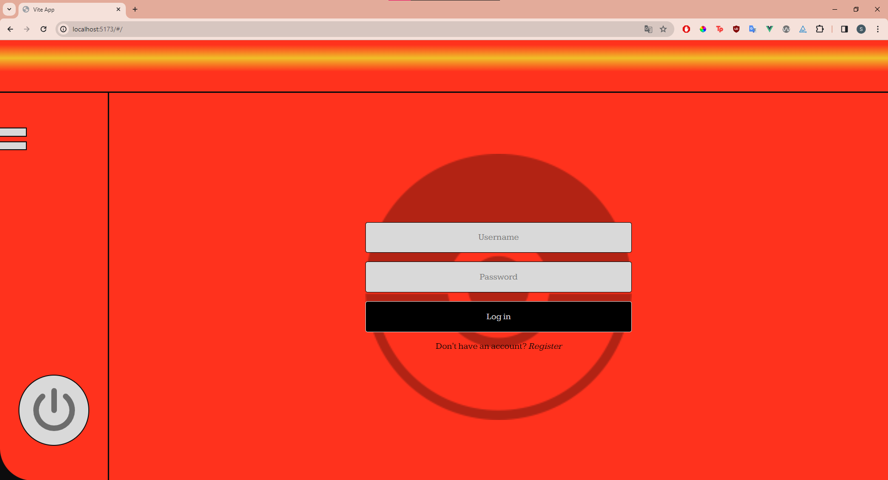
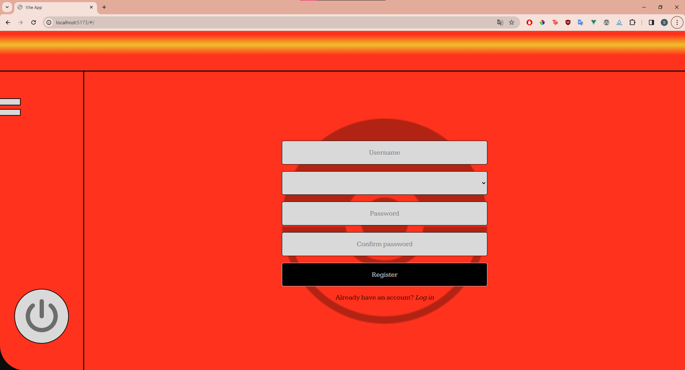
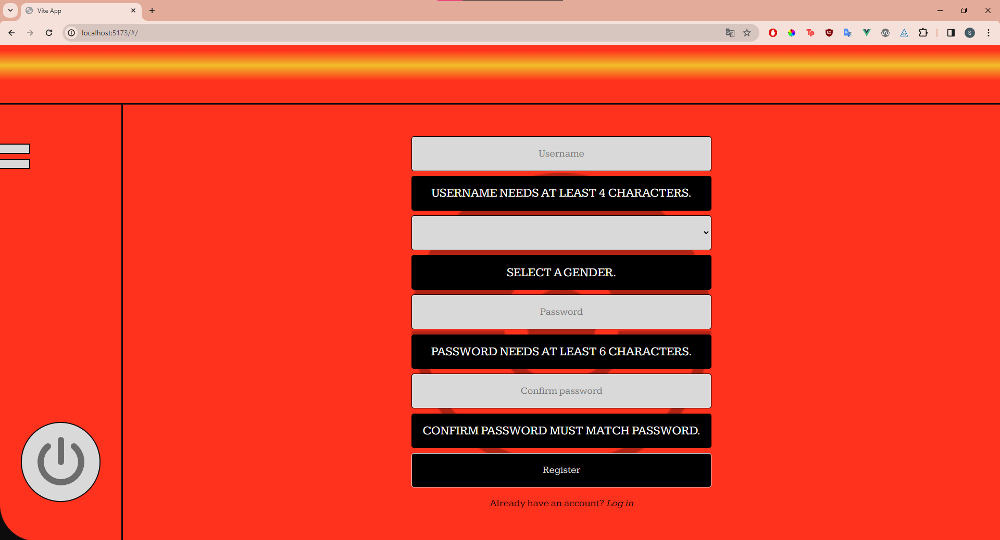
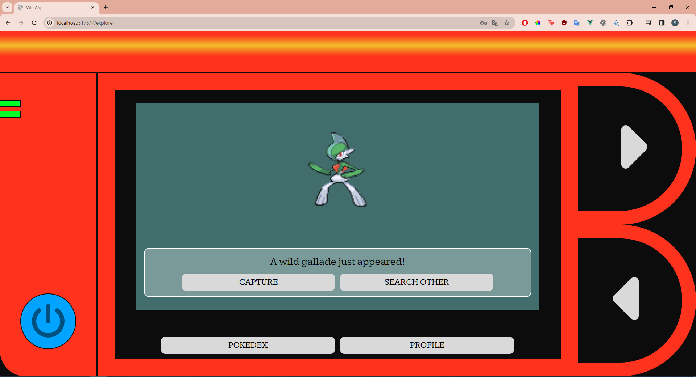
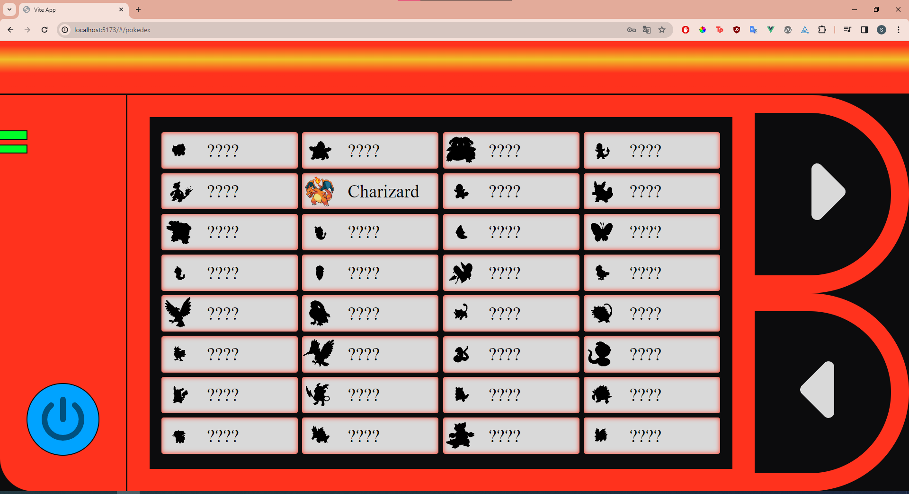
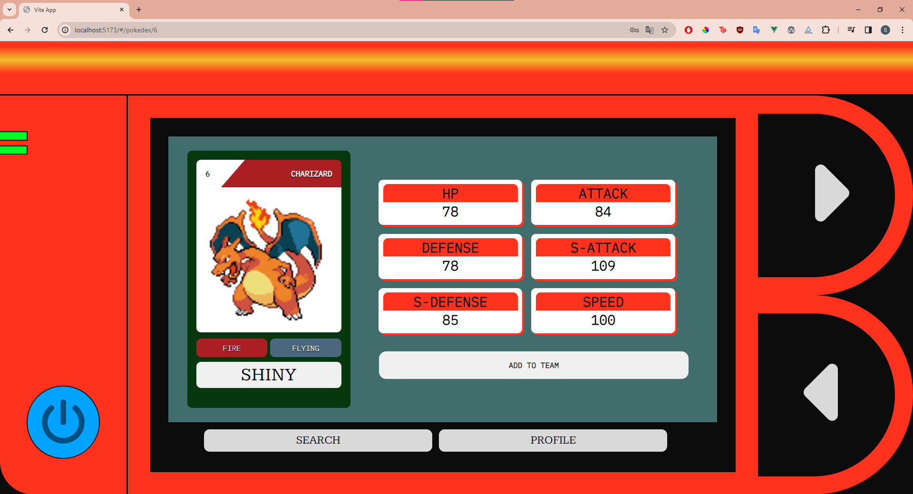
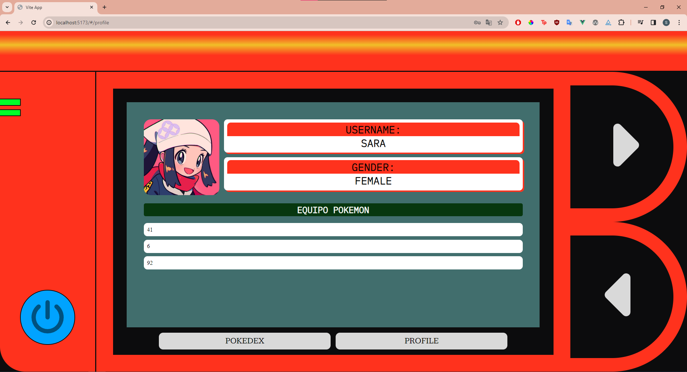
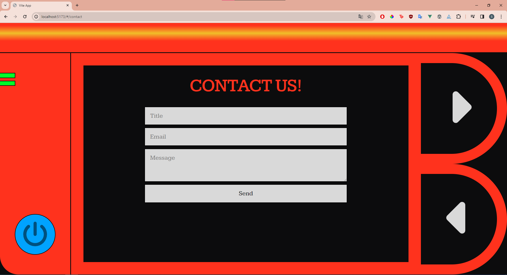
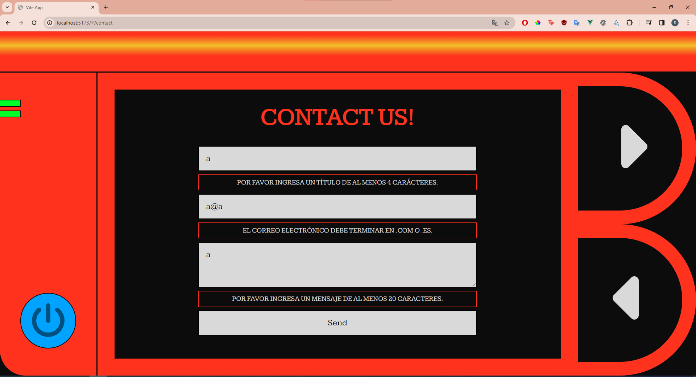
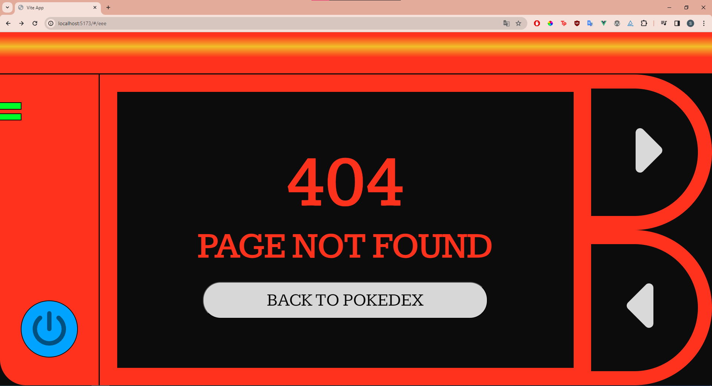

# INTRODUCCIÓN

El proyecto realizado se trata de una pokedex. En ella, podremos interactuar para buscar pokemons e intentar capturarlos, y luego podremos acceder al listado de todos aquellos pokemons disponibles. Los que hayan sido vistos pero no capturados aparecerán con la imagen en blanco y negro, los que hayan sido capturados con la imagen a color y aquellos que aún no hemos tenido si quiera la oportunidad de ver aparecen ocultos (en negro) y el nombre no será visible.

Para el proyecto se ha utilizado Vue, Axios, el componente de vue de fontawesome, routerlink, pinia. En cuanto a maquetación, se ha optado por BEM como nomenclatura, haciendo uso de nesting en el CSS.

No partía con base respecto a vue, la única experiencia que puedo considerar similar fue la creación de la API de DnD con React.

# INSTALACIÓN Y PREPARACIÓN

## Project Setup

```sh
npm install
```

### Compile and Hot-Reload for Development

```sh
npm run dev
```

### Compile and Minify for Production

```sh
npm run build
```

### Lint with [ESLint](https://eslint.org/)

```sh
npm run lint
```

# DESARROLLO

Empecé el proyecto por la página de contacto, así como el login y registro. También hice la página de error. A lo largo del proyecto he ido encontrando dificultades en ocasiones por problemas en el servidor y las peticiones. También, al haber decidido optar por un diseño poco convencional, he invertido bastante tiempo en intentar hacerlo lo más responsive posible, lo cual ha supuesto un reto al haber ocasiones que no conseguía el resultado deseado. He realizado ampliaciones con las que no contaba en el proyecto, como el listado de pokemons, comprobando si los pokemons están capturados o no, al igual que si se han visto o no, y ha supuesto también que otras funcionalidades que tenía pendientes no pudiera llevarlas a cabo. Creo que es un proyecto que  tiene tantas posibilidades y caminos que al final he querido abarcar más por otros lados y lo que tenía en mente desde el principio no he podido abarcarlo como me hubiera gustado.

# MANUAL DE LA APLICACIÓN

## Login y Registro

Página para crearse un usuario y poder loguearse. Tienen requisitos mínimos que se despliegan en el registro si intentar registrarte sin cumplirlos. El registro te muestra un mensaje verde cuando ha sido registrada la cuenta con éxito y te redirige a la vista del login.







## EXPLORE

Aquí puedes buscar pokemons o en su defecto, intentar capturarlo. Si capturas, tras un setTimeOut  te buscará aleatoriamente otro pokemon. La pokedex actualiza su estado según si solo ve o si ve y captura el pokemon. Si quieres desloguearte tienes el botón azul de la izquierda, lo cual te redirigirá al login.



## POKEDEX

Imagen en negro y nombre '????' : no visto.

Imagen en blanco y negro con nombre: visto pero no capturado.

Imagen a color: capturado.

Los botones de la derecha son útiles en esta página y sirven para pasar a otros pokemons.

Si clickas en un pokemon que esté visto (independientemente de si está capturado o no), entras a su información.



## POKEMON INFORMACIÓN

El botón de shiny cambia la imagen para mostrar el pokemon shiny.

El botón add to team te permite añadirlo al equipo.

Los botones de la derecha te permiten ver el resto de pokemon, independientemente de si los viste o no.



## PROFILE

Te muestra tu perfil. Si clickas en los ids de los pokemons en tu equipo te lleva a la página de información de dicho pokemon, tal y como está arriba.



## CONTACT

Sirve para contactar y tiene también validación de formulario.





## ERROR PAGE

Muestra una animación y tras ello te permite regresar a la pokedex (o al login en caso de estar desconectado)



## REFLEXIÓN

Una de las cosas que he aprendido es que he de mejorar mi gestión del tiempo y el hacer un producto mínimo viable. He querido ir añadiendo cosas, lo cual me ha dejado cosas que tenía en mente en un principio en el tintero y sin poder pulir controles de errores que me gustaría haber dejado bien. Por añadir funcionalidades, como puede ser la lista con los diferentes estados de los pokemon (no visto, visto, capturado) han habido cosas que no quedaron pulidas. Para la próxima vez, creo que debería respetar mi propia idea inicial y sólo una vez eso esté completo, añadir extras.

## PRESENTACIÓN

https://curious-frangipane-e51feb.netlify.app/#/
